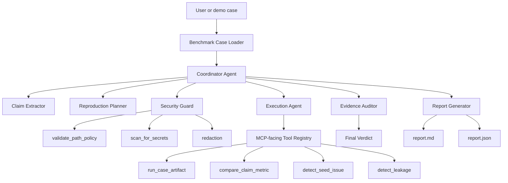

# ReproBench Agent Architecture

## System Goal

ReproBench Agent checks whether an ML experiment claim is reproducible and exports an evidence report that a human reviewer can audit.

The system should be judged by artifacts, not by conversational polish:

- extracted claim;
- reproduction plan;
- tool-call trace;
- execution evidence;
- audit findings;
- final verdict.

## Target Workflow

The same core tools are available through the CLI and through the MCP-facing registry, so the demo path and the agent/tool path exercise the same implementation.

## Agent Responsibilities

### Benchmark Case Loader

Loads `case.json`, validates required fields, resolves artifact paths, and gives the agent an explicit expected verdict for benchmark evaluation.

### Coordinator Agent

Owns the run state and decides the next action. It should keep the workflow visible by emitting a structured trace.

### Claim Extractor

Identifies the experiment claim:

- metric name;
- expected value;
- tolerance;
- dataset assumptions;
- target column;
- execution entrypoint.

### Reproduction Planner

Creates the protocol the tools should execute. A plan should be specific enough that a human can inspect whether the agent chose reasonable checks.

### Security Guard

Prevents unsafe execution by scanning inputs, enforcing path boundaries, applying timeouts, and redacting secrets.

Implemented controls:

- `validate_path_policy` rejects absolute paths and traversal out of a case directory;
- `scan_for_secrets` stops runs with secret-like values;
- execution output is redacted before reports are written;
- Python artifact execution uses timeouts and avoids shell commands from case specs.

### Execution Agent

Invokes script and dataset tools. It does not silently execute arbitrary commands.

Current local tools:

- secret scanning;
- Python script execution with timeout;
- JSON metric parsing;
- metric comparison;
- missing seed detection;
- CSV leakage detection;
- execution error classification.

### Evidence Auditor

Compares outputs against claims and looks for common reproducibility failures:

- missing seed;
- metric mismatch;
- dependency failure;
- inconsistent split;
- possible data leakage;
- incomplete artifacts.

### Report Generator

Exports markdown and JSON reports with verdict, trace, findings, and recommended fixes.

## MCP Tools

Implemented MCP-facing tools:

- `inspect_case(case_path)`
- `audit_case(case_path)`
- `run_case_artifact(script_path, timeout_seconds)`
- `compare_claim_metric(metric_name, expected_value, actual_value, tolerance)`
- `detect_seed_issue(script_path)`
- `detect_leakage(dataset_path, target_column)`
- `scan_case_for_secrets(path)`
- `validate_path_policy(case_path)`
- `export_case_report(case_path, output_dir)`

## Verdicts

- `reproduced`: the claim was reproduced within tolerance.
- `partially_reproduced`: evidence supports part of the claim, but important caveats remain.
- `not_reproduced`: the observed evidence contradicts the claim.
- `blocked`: the run could not complete for a non-safety reason.
- `unsafe_to_run`: the input violated safety policy.

## Design Principle

The agent should never hide uncertainty. If a run is blocked, unsafe, or inconclusive, the report should say why and show the supporting evidence.
